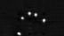
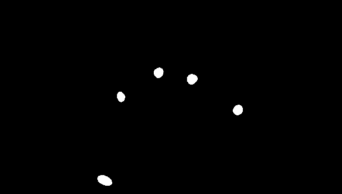

# Research repository for CapContact

[Paul Streli](https://www.paulstreli.com) and [Christian Holz](https://www.christianholz.net)<br/>
[Sensing, Interaction & Perception Lab](https://siplab.org) <br/>
Department of Computer Science, ETH Zürich

This is the research repository for the ACM CHI 2021 Paper: "CapContact: Super-resolution Contact Areas from Capacitive Touchscreens." This repository contains the dataset we collected on capacitive imprints and actual contact masks in high-resolution based on recordings using frustrated total interal reflection.

[![CC BY-NC-SA 4.0][cc-by-nc-sa-shield]][cc-by-nc-sa]


## Dataset

The records stem from a data collection with 10 participants and 3 sessions each. The records are provided in png format (8-bit encoding) as well as in a numpy array (16-bit capacitive images from the mutual-capacitance digitizer, 8-bit contact masks).

The **capacitive images** result from a Microchip ATMXT2954T2 digitizer with 16-bit precision with a resolution of 72&nbsp;px × 41&nbsp;px and the ITO diamond gridline sensor covered an area of 345&nbsp;mm × 195&nbsp;mm (15.6″ diagonal).

The actual **contact masks** are derived from a frustrated total internal reflection (FTIR) setup using a camera. Contact images have a resolution of 576&nbsp;px × 328&nbsp;px. This amounts to a super-resolution factor of 8×.

| capacitive image    | contact mask (FTIR)   |
| :------------------ | :-------------------- |
| resolution: 72 x 41 | resolution: 576 x 328 |
|  |  |

The `numpy` arrays can be loaded using python as follows:

```python
sample  = np.load('CapContact-dataset/P01/1/npz/0133.npz')
cap     = sample['cap']
contact = sample['ftir']
```

## Code

Our trained models as well as the code to train and test models will be uploaded soon.


## Publication reference

Paul Streli and Christian Holz. 2021. CapContact: Super-resolution Contact Areas from Capacitive Touchscreens. Proceedings of the 2021 CHI Conference on Human Factors in Computing Systems. Association for Computing Machinery, New York, NY, USA, Article 289, 1–14. DOI:https://doi.org/10.1145/3411764.3445621

### Direct links

* [CapContact paper PDF](https://siplab.org/papers/chi2021-capcontact.pdf)
* [CapContact video](https://www.youtube.com/watch?v=oCtj-eQpIQI)
* [CapContact presentation video](https://www.youtube.com/watch?v=qtf6u4pJoyA)
* [CapContact project page](https://siplab.org/projects/CapContact)

### BibTeX reference

```
@inproceedings{10.1145/3411764.3445621,
  author = {Streli, Paul and Holz, Christian},
  title = {CapContact: Super-Resolution Contact Areas from Capacitive Touchscreens},
  year = {2021},
  isbn = {9781450380966},
  publisher = {Association for Computing Machinery},
  address = {New York, NY, USA},
  url = {https://doi.org/10.1145/3411764.3445621},
  booktitle = {Proceedings of the 2021 CHI Conference on Human Factors in Computing Systems},
  articleno = {289},
  numpages = {14}
}
```

## Abstract

Touch input is dominantly detected using mutual-capacitance sensing, which measures the proximity of close-by objects that change the electric field between the sensor lines. The exponential drop-off in intensities with growing distance enables software to detect touch events, but does not reveal true contact areas. In this paper, we introduce CapContact, a novel method to precisely infer the contact area between the user’s finger and the surface from a single capacitive image. At 8x super-resolution, our convolutional neural network generates refined touch masks from 16-bit capacitive images as input, which can even discriminate adjacent touches that are not distinguishable with existing methods. We trained and evaluated our method using supervised learning on data from 10 participants who performed touch gestures. Our capture apparatus integrates optical touch sensing to obtain ground-truth contact through high-resolution frustrated total internal reflection. We compare our method with a baseline using bicubic upsampling as well as the ground truth from FTIR images. We separately evaluate our method’s performance in discriminating adjacent touches. CapContact successfully separated closely adjacent touch contacts in 494 of 570 cases (87%) compared to the baseline's 43 of 570 cases (8%). Importantly, we demonstrate that our method accurately performs even at half of the sensing resolution at twice the grid-line pitch across the same surface area, challenging the current industry-wide standard of a ∼4mm sensing pitch. We conclude this paper with implications for capacitive touch sensing in general and for touch-input accuracy in particular.


## Disclaimer

The dataset and code in this repository is for research purposes only. If you plan to use this for commercial purposes to build super-resolution capacitive touchscreens, please [contact us](https://siplab.org/contact). If you are interested in a collaboration with us around this topic, please also [contact us](https://siplab.org/contact).


```
THE PROGRAM IS DISTRIBUTED IN THE HOPE THAT IT WILL BE USEFUL, BUT WITHOUT ANY
WARRANTY. IT IS PROVIDED "AS IS" WITHOUT WARRANTY OF ANY KIND, EITHER EXPRESSED
OR IMPLIED, INCLUDING, BUT NOT LIMITED TO, THE IMPLIED WARRANTIES OF
MERCHANTABILITY AND FITNESS FOR A PARTICULAR PURPOSE. THE ENTIRE RISK AS TO THE
QUALITY AND PERFORMANCE OF THE PROGRAM IS WITH YOU. SHOULD THE PROGRAM PROVE
DEFECTIVE, YOU ASSUME THE COST OF ALL NECESSARY SERVICING, REPAIR OR
CORRECTION.

IN NO EVENT UNLESS REQUIRED BY APPLICABLE LAW THE AUTHOR WILL BE LIABLE TO YOU
FOR DAMAGES, INCLUDING ANY GENERAL, SPECIAL, INCIDENTAL OR CONSEQUENTIAL
DAMAGES ARISING OUT OF THE USE OR INABILITY TO USE THE PROGRAM (INCLUDING BUT
NOT LIMITED TO LOSS OF DATA OR DATA BEING RENDERED INACCURATE OR LOSSES
SUSTAINED BY YOU OR THIRD PARTIES OR A FAILURE OF THE PROGRAM TO OPERATE WITH
ANY OTHER PROGRAMS), EVEN IF THE AUTHOR HAS BEEN ADVISED OF THE POSSIBILITY OF
SUCH DAMAGES.
```

## License

This work is licensed under a [Creative Commons Attribution-NonCommercial-ShareAlike 4.0 International License][cc-by-nc-sa].

[![CC BY-NC-SA 4.0][cc-by-nc-sa-image]][cc-by-nc-sa]

[cc-by-nc-sa]: http://creativecommons.org/licenses/by-nc-sa/4.0/
[cc-by-nc-sa-image]: https://licensebuttons.net/l/by-nc-sa/4.0/88x31.png
[cc-by-nc-sa-shield]: https://img.shields.io/badge/License-CC%20BY--NC--SA%204.0-lightgrey.svg
